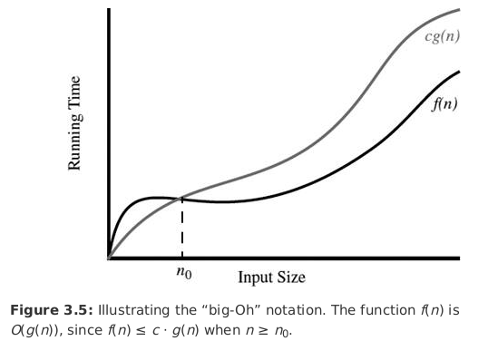
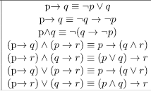

# One way of measure the executing running time

In python there is a function called time, but this dependent on CPU power and differs between machines.

<h2>Important functions</h2>

<h3>1. Constant function</h3>

    f(n) = c

For any argument n, the function always assigns the value C

<h3> 2. The logarithm functions </h3>

    f(n) = log(n)  

In this case we'll consider the base of the algorithm function as 2, that's because the computer store integers in binary and a common operation in many algorithms is to divide the input in half.

<h3> 3. Linear function </h3>

    f(n) = n

Given an input n, the linear function assigns the value n, this function is called each time we have to do a single operation for each n element.

For example comparing a number with each number of a sequence of size *n* will require *n* comparisons.

<h3> 4. Log-n functions </h3>

    f(n) = n* log(n)

  This function grows a little more rapidly than the linear and a lot less than a quadratic function.

  <h3> 5. Quadratic function </h3>

      f(n) = n²

Many algorithms have nested loops, where both the inner and the outer loops perform a linear number operation, hence why we may end up with quadratic functions.

<h3> 6. Exponential function </h3>

    f(n) =b^n

When an operation is computed twice or more in a loop, then the number of operations computed per n-th iteration is 2^n.

<h2>The "BIG-OH" Notation</h2>

Let f(n) and g(n) be function mapping positive integers to real numbers, we can say that f(n) is O(g(n)) if there are a constant c > 0 and one integer n0 > 1 such that.

```python
f(n) >= c*g(n)  ## for n > n0

```

 

I.e. Big-O is an upper limit for a values greater than n0...


 It\'s considered poor taste to say `f(n) < O(g(n))` since the big-oh already denotes the less.Is the better to say `f(n) is  O(g(n))` since f(n) is a subset of g(n) for some values c > 0 and n0.

The following snippet belongs to an algorithm that searches the greater value in one list. To perform such a task, the code must compare each element of the list, which means that the code runs in O(n).

```python
 def find_max(data):
   '''Return the biggest value in a Python list
   input -> Python list
   output -> max value of the list
   '''
   biggest = data[0]
   for i in data:
       if i > biggest:
           biggest = i
   return biggest
```
Big-O ignores constant factors and lower ordered terms. For example, the function 5n⁴ + 3n³ + 2n² + 4 is O(n⁴).

<h2> Big Omega</h2>

Just as Big-O notation denotes an upper limit, i.e. a function is "less than or equal to", big omega Ω shows how a function grows at a rate that is greater than or equal to, i.e. a lower limit or lower bound of a function for some value n0 > 0.

For instance 3nlog(n) - 2n is Ω( nlog(n))

<h2>Prefix average</h2>

To see how big-oh works let us consider a problem known as prefix average. This computes the average of all values previous to an index given; for example in a sequence S the average of a given index is A[j] = s[0], .. s[j] for j= 0,...(n-1).

For example:


The following snippet implements one algorithm that is O(n²).

``` python
def prefix_average(s):
    '''
    Return list such that, for all j, A[j] equals average s[0]..,s[j]
    '''
    average = [0]*len(s)
    for i in range(len(s)):
        total = 0
        for j in range(i+1):
            total += s[j]
        average[i] = total/(i+1)
    return average
```
The steps executed for the before snippet are:
* The statement len(s) executes in constant time because the list constructor save the number of inputs of the list and when we call len function it had just performed one operation, but the operation [0]*n must to perform n operation, that because the [0]*len(s)
take at least O(n).

* The first loop is managed by the counter i that it's executed i = 0, 2 ,..n-1, therefore the first loop is O(n).

* The nested loop is controlled by the counter j which has to performed 1 + 2 + 3 + ...n times that is equal to n(n+1)/2 which implies O(n²).

The following code is a different way of writing the prefix_average

```Python
def prefix_average2(s):
     '''
    Return list such that, for all j, A[j] equals average s[0]..,s[j]
    '''
    average = [0]*len(s)
    total = 0
    for i in range(len(s)):
        total += s[i]
        average[i] = total/(i+1)
    return average
```

* The previously algorithm is O(n) because has just one loop that is executed i = 0, 1...n+1.

although we said that measure the time is not a good estimator, 'cause depend on other factors this time running both algorithms whit a list of 500 items, the difference is until 64 times faster prefix_average2 than prefix_average.

```python
start = time.time()
prefix_average(a)
finish = time.time()
time_taken = finish - start
print(time_taken)

start = time.time()
prefix_average2(a)
finish = time.time()
time_taken1 = finish - start
print(time_taken1)
print(f'the first code take aprox %1.f more times than the second' % (time_taken/time_taken1) )
```
<h2>Justification Techniques</h2>

Sometimes when we want to show that some algorithm run fast or even it's correct, we must use mathematical language in order to back up such claims, for doing that is needed to use some techniques.

<h3>1. By example</h3>

Sometimes when we have to show for example that every element x in a set S has property P. to justify that such a claim it's false is enough with show a case where it doesn't fill such a property.

__Example__: Every number of the form 2^i - 1 is prime
to show that it's false is enough with show that 2^4-1 = 15 = 3.5

<h3>The Contra Attack</h3>

There are basically two methods and are **contrapositive** and **contradiction** the contraposive is just for example if we have "if p is true then q is true" to justify that we establish "if not q then p is false" instead, these two statement are the same.

 the following image show some basics rules of propositional equivalences

 

 the second row of the previous image show that the contraposive is a tautology.

 __Example__: let a and b integers, if ab is even, then a is even or b is even.

 to justify this claim, consider the contrapositive, 'if a is odd and b is odd then ab is odd'

 __Dm__

 So suppose that a = 2\*i+1, and b = 2\*k+1 the a*b is then  4*i*k+2\*i+2\*k + 1 = 2(2*i*k + i + j ) + 1, hence ab is odd.


__contradiction__

In this case we establish that a statement q is true by first supposing that q is false and then showing that this assumption leads to contradiction such as 2 ≠ 2 or 1>3, by achieving this we show that no consist situation exist when q is false, therefore q must be true.

__Example__: Let a and b be integers, if ab is odd then a is odd and b is odd.

__Dm__

with the hope of leading to a contradiction we assume that a is even or b is even, then a = 2*j, hence ab = 2(j)b = 2\*(jb), but this is a contradiction because ab can't be even and odd simultaneously therefore a is odd and b is odd.

<h3>Induction and loop invariant</h3>

Most of the claims we make about a running time or space bound involve a integer n (usually denoting the notion of the size), and such a claims are equivalent to say q(n) is true for all n >= 1, it's mean that we are making a claim for a infinite set of number, and we can't justify that in a direct fashion.

 __Induction:__

For any particular n>=1 there is a finite sequence of implications that start with something known to be true and ultimately leads to showing that q(n) is true.

We begin a justification by induction by showing that q(n) is true for n=1 (and possibly some other values n=2,3...k for some constant k). Then we justify that the inductive step is true for n>k, namely we show "if q(n) is true for all j<n then q(n) is true", the combination of these two steps completes the justification by induction.

__Loop invariants:__

To prove if some statement L about a loop is correct, define L in terms of a series of smaller statement L0, L1, ...Lk

1. The initial claim, L0 is true before the loop begin

2. if L<sub>j-1</sub> is true before iteration j then L<sub>j</sub> will be true after iteration j.

3. The final statement L<sub>k</sub> implies the desired statement L to be true
